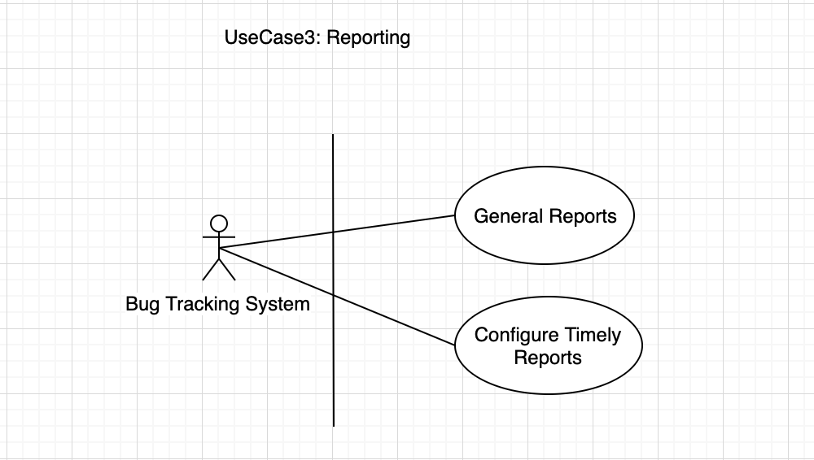

# Bug Tracking with Micro-Services Architecture.
## Reporting Service

     Fig. 1: Use Case For The Reporting Service.
      

* This service will handle generating bug report for the actors in the system.
* It will take an input of time range to generate the report automatically or manually.
* The report will only be generable by actors with the permission in the system.
* The report will be sent to the actor’s email address.
* The generated report details will be stored to the database.
